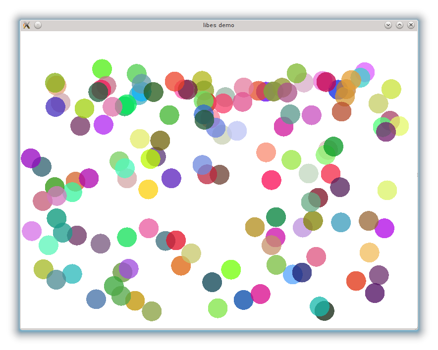

# libes tutorial

## Introduction

In this tutorial, we will learn how to use `libes` through a simple example:
balls. The idea is to create and handle some balls that will move thanks to
gravity. For the sake of simplicity, we will not handle collisions between
balls. A mouse click will create a ball with a random color and a random
color at the position of the mouse.

We will use [SFML](http://sfml-dev.org/) to get the user's event and display
the balls.

### Model

Before starting the code, we have to think about how to model our
application.

All balls have the same radius and are represented by their center. The
world is defined by cartesian coordinates with the origin in the bottom left
corner and the y-axis going up. The ground is the line `y=0`, and the walls
are the lines `x=0` and `x=WIDTH`.

This description should be enough.

## Components

Now, let's define the components that we need.

### Position

A ball has a position, i.e. a 2D vector that represents its coordinates in
the world's plane. We use `sf::Vector2f` to internally represent the
position of the ball.

```cpp
struct Position : public es::Component {
  sf::Vector2f vec;

  Position(sf::Vector2f _vec)
    : vec(_vec)
  { }

  static const es::ComponentType type = 1;
};
```

### Speed

A ball has a speed. We need it for computing the physics of the world. We
internally represent the speed vector by a `sf::Vector2f`.

```cpp
struct Speed : public es::Component {
  sf::Vector2f vec;

  Speed(sf::Vector2f _vec)
    : vec(_vec)
  { }

  static const es::ComponentType type = 2;
};
```

### Coords

A ball has coordinates on the screen that must be computed from the position
in the world. Again, we use a `sf::Vector2f` to internally represent the
coordinates on the screen.

```cpp
struct Coords : public es::Component {
  sf::Vector2f vec;

  Coords(sf::Vector2f _vec)
    : vec(_vec)
  { }

  static const es::ComponentType type = 3;
};
```

### Look

Finally, a ball has a look, which is here defined by a color of type
`sf::Color`. The color will be chosen at random.

```cpp
struct Look : public es::Component {
  sf::Color color;

  Look(sf::Color _color)
    : color(_color)
  { }

  static const es::ComponentType type = 4;
};
```

## Systems

For our example, we will describe four classical systems that you may use in
your own projects:

* Input, which is responsible for player's input.
* Physics, which is responsible for the objects physics (forces, collisions).
* Graphics, which is responsible for the translation between the world's
  position and the screen coordinate.
* Render, which is responsible for rendering the objects on the screen.

### Input

The input system does not need any components. It just has to handle the
player's input so we use the `preUpdate()` method. With SFML, we need the
window to get the relevant inputs, so we pass a pointer of the window to this
system.

Closing the window and pressing the escape key will stop the program. A left
click should create a new ball and a right click should create ten new balls.
We call a `createBall()` function (that will be described later) to create the
balls.

```cpp
void Input::preUpdate() {
  sf::Event event;

  while (m_window->pollEvent(event)) {
    switch (event.type) {
      case sf::Event::Closed:
        m_window->close();
        break;

      case sf::Event::KeyPressed:
        switch (event.key.code) {
          case sf::Keyboard::Escape:
            m_window->close();
            break;

          default:
            break;
        }
        break;

      case sf::Event::MouseButtonPressed:
        switch (event.mouseButton.button) {
          case sf::Mouse::Left:
            createBall(getManager(), {
                static_cast<float>(event.mouseButton.x),
                static_cast<float>(HEIGHT - event.mouseButton.y)
            });
            break;

          case sf::Mouse::Right:
            for (int i = 0; i < 10; ++i) {
              createBall(getManager(), {
                  static_cast<float>(event.mouseButton.x),
                  static_cast<float>(HEIGHT - event.mouseButton.y)
              });
            }
            break;

          default:
            break;

        }
        break;

      default:
        break;
    }
  }
}
```


### Physics

The physics system need the position and the speed of the entities. Then,
applying the
[Newton's law](http://en.wikipedia.org/wiki/Newton%27s_laws_of_motion), we
can update the position and speed of the entities. More precisely, the only
force is the gravity so the equations are quite simple:

    m.a = m.g <=> m.dv/dt = m.g <=> dv/dt = g <=> dv = g.dt

where `dt` is the period since the last update. After a projection on the
axis, we get:

    dvx = 0
    dvy = -G.dt

For the position, it is easier:

    v = dp/dt <=> dp = v.dt

Again, after a projection on the axis, we get:

    dx = vx.dt
    dy = vy.dt

So, on each time step `dt`, we must add `dvx` to `vx`, `dvy` to `vy`, `dx` to
`x` and `dy` to `y`. This is what we do first:

```cpp
void Physics::updateEntity(float delta, es::Entity e) {
  Position *pos = getManager()->getComponent<Position>(e);
  assert(pos);

  Speed *speed = getManager()->getComponent<Speed>(e);
  assert(speed);

  // apply gravity
  speed->vec.y += -GRAVITY * delta;

  pos->vec.x += speed->vec.x * delta;
  pos->vec.y += speed->vec.y * delta;
```

Then, we have to handle collisions. The only possible collisions are with the
ground or with the walls. We decide that a collision with the walls will
conserve the energy of the ball, which means that the absolute speed will
stay the same, and a collision with the ground will loose some energy, the
speed will be decreased by a constant factor.

```cpp
  // detect collision with the ground
  if (pos->vec.y < RADIUS) {
    pos->vec.y = RADIUS;
    speed->vec.y = -speed->vec.y * LOSS;
  }

  // detect collision with the left wall
  if (pos->vec.x < RADIUS) {
    pos->vec.x = RADIUS;
    speed->vec.x = -speed->vec.x;
  }

  // detect collision with the right wall
  if (pos->vec.x > WIDTH - RADIUS) {
    pos->vec.x = WIDTH - RADIUS;
    speed->vec.x = -speed->vec.x;
  }

}
```

We now have a very basic physics engine. To go further on this topic, you
should read the
[article series on game physics](http://gafferongames.com/game-physics/) by
Glenn Fiedler.

### Graphics

The graphics system need the position and the coordinates of the entities. It
will transform the world position in screen coordinates. In our case, it is
quite simple. The x-axis is the same and the y-axis is reversed. The origin
in the world, which is bottom left is transformed to the origin on the screen,
which is top left.

```cpp
void Graphics::updateEntity(float delta, es::Entity e) {
  Position *pos = getManager()->getComponent<Position>(e);
  assert(pos);

  Coords *coords = getManager()->getComponent<Coords>(e);
  assert(coords);

  coords->vec.x = pos->vec.x;
  coords->vec.y = HEIGHT - pos->vec.y;
}
```

And that's all!

Note that the reversed equation was used in the input system to transform
coordinates into a world position.

### Render

Finally, the render system need the coordinates and the look of the entities.
We just have to draw each entity with a circle centered on the coordinates
and with the fixed predefined radius.

```cpp
void Render::updateEntity(float delta, es::Entity e) {
  Coords *coords = getManager()->getComponent<Coords>(e);
  assert(coords);

  Look *look = getManager()->getComponent<Look>(e);
  assert(look);

  sf::CircleShape shape(RADIUS);
  shape.setFillColor(look->color);
  shape.setOrigin(RADIUS, RADIUS);
  shape.setPosition(coords->vec);

  m_window->draw(shape);
}
```

We also need to clear the window before any drawings occur, and display it
after all drawings are done. We can use the `preUpdate()` and `postUpdate()`
methods.

```cpp
void Render::preUpdate() {
  m_window->clear(sf::Color::White);
}

void Render::postUpdate() {
  m_window->display();
}
```

## Archetypes and entities

In our case, we only have one archetype (i.e. type of entity): a ball.
Anyway, we create a function to create a ball entity and a function to
destroy the ball. They are responsible for the memory management of the
components. In our case, we use `new` and `delete` but if memory becomes a
bottleneck, you may want to use something like
[Boost.Pool](http://www.boost.org/doc/libs/release/libs/pool/).


```cpp
es::Entity createBall(es::Manager *manager, sf::Vector2f pos) {
  es::Entity e = manager->createEntity();

  manager->addComponent(e, new Position(pos));
  manager->addComponent(e, new Speed({
      static_cast<float>(std::rand() % 500) - 250.0f,
      static_cast<float>(std::rand() % 300) - 150.0f
  }));
  manager->addComponent(e, new Coords({ 0., 0.}));
  manager->addComponent(e, new Look({
    static_cast<sf::Uint8>(std::rand() % 256),
    static_cast<sf::Uint8>(std::rand() % 256),
    static_cast<sf::Uint8>(std::rand() % 256),
    192 // some transparency
  }));
  manager->subscribeEntityToSystems(e, { Position::type, Speed::type, Coords::type, Look::type });

  return e;
}

void destroyBall(es::Manager *manager, es::Entity e) {
  delete manager->extractComponent<Position>(e);
  delete manager->extractComponent<Speed>(e);
  delete manager->extractComponent<Coords>(e);
  delete manager->extractComponent<Look>(e);
  manager->destroyEntity(e);
}
```

Easy, isn't it?

## The main program

The last part of this tutorial is the main program.

The first task of the main program is to create the stores for the
components. It tells the manager what kind of components exists and
allocate a store for this component.

```cpp
es::Manager manager;

// prepare the components

manager.createStoreFor(Position::type);
manager.createStoreFor(Speed::type);
manager.createStoreFor(Coords::type);
manager.createStoreFor(Look::type);
```

Then, the second task of the main program is to create the systems. As we
need a window for the input system and the render system, we also create it.
Then, we initialize all the systems.

```cpp
sf::RenderWindow window(sf::VideoMode(WIDTH, HEIGHT), "libes demo",
    sf::Style::Titlebar | sf::Style::Close);

// prepare the systems

manager.addSystem<Input>(&manager, &window);
manager.addSystem<Physics>(&manager);
manager.addSystem<Graphics>(&manager);
manager.addSystem<Render>(&manager, &window);

manager.initSystems();
```

Finally, the third part of the main program is the main loop. This loop is
very simple and is always the same for any game as all the code is in
systems.

```cpp
// enter the game loop

sf::Clock clock;
while (window.isOpen()) {
  sf::Time elapsed = clock.restart();
  float delta = elapsed.asSeconds();
  manager.updateSystems(delta);
}
```

That's all.

## Conclusion

The full source code of this tutorial is available in the
[`examples/simple_balls` directory on github](https://github.com/jube/libes/tree/master/examples/simple_balls).
You can compile it and run it.



## Add-ons

Here are some ideas to extend this little demo.

### Other kinds of entities

Creating other kind of entities is quite easy. If the archetypes only need
existing components, all you have to do is write a function to create an
entity of the archetype (and a function to destroy it) and that's all.

If you need another component, then create the component, and do not forget
to create a store for it.

As an exercice, you could try to create:
* a fixed ball i.e. a ball that can not move (easy)
* a dividing ball i.e. a ball that creates another ball each time it touches
  the ground (difficult)

### Memory management and life time of entities

Memory management was quite easy with one archetype. You can see in the
source code that we destroy all the balls after the main loop. But what if
there are several entities? And what if I want to destroy an entity in the
middle of the game? Good questions! And if you understand how entity systems
work, you already have the answer.

One way to do it is to create another component, called Lifetime, and a
corresponding system, called [Hades](http://en.wikipedia.org/wiki/Hades), for
managing the entities.

```cpp
typedef void (*DestroyFunc)(es::Manager*, es::Entity);

struct Lifetime {
  bool alive;
  DestroyFunc destroy;

  Lifetime(DestroyFunc _destroy)
    : alive(true)
    , destroy(_destroy)
  {  }

  static const es::ComponentType type = 5;
}
```

You can see that your `destroyBall()` function has the good prototype.

```cpp
void Hades::updateEntity(float delta, es::Entity e) {
  Lifetime *lifetime = getManager()->getComponent<Lifetime>(e);
  assert(lifetime);

  if (!lifetime->alive) {
    lifetime->destroy(getManager(), e);
  }
}
```

Then, you just have to add the lifetime component to all the entities that
you want to manage this way.

As an exercice, you could improve this component and this system to allow
transient entities i.e. entities that have a predefined lifetime.
